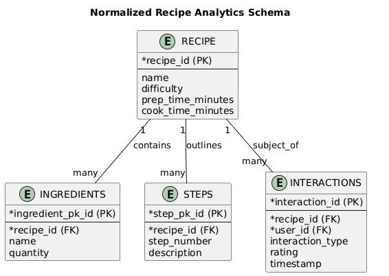
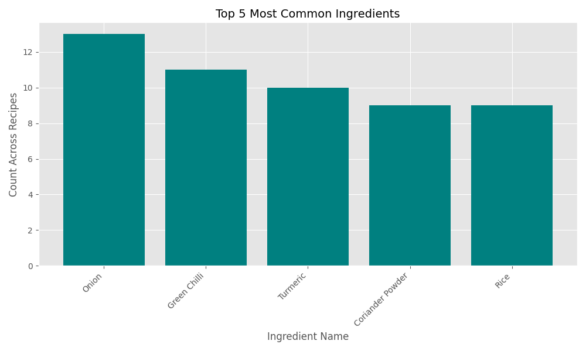
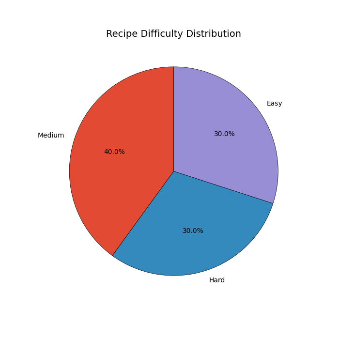
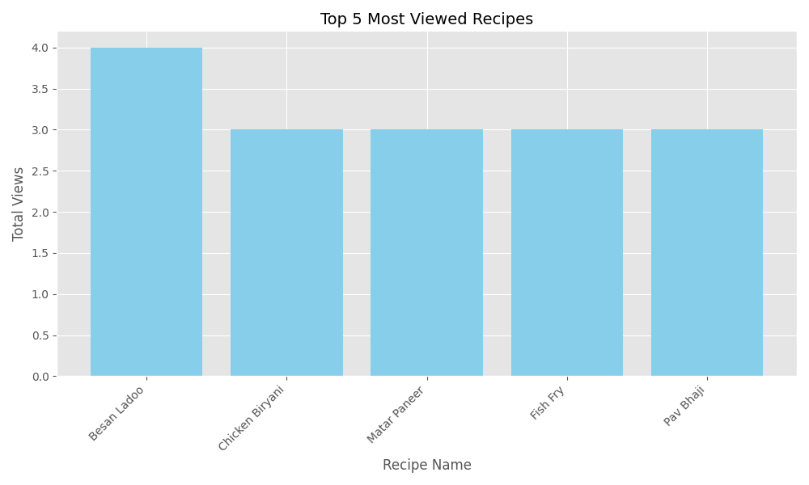
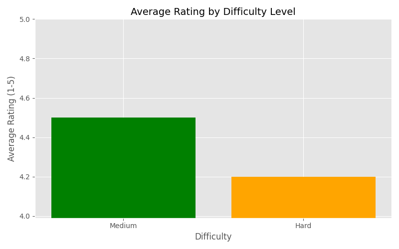

 Recipe Analytics Data Pipeline
==============================

### **Author:** Shruti G. Bonde  <br> 
### **E-Mail:** shrutibonde2003@gmail.com <br>
### **Role:** Data Engineer <br>
### **Project:** Firestore to Recipe Analytics Pipeline
 
---
This project demonstrates a complete end-to-end data engineering workflow using **Firebase Firestore** as the data source, followed by an ETL (Extract--Transform--Load) pipeline, data quality validation, and analytics generation. The goal is to take raw, semi-structured recipe data from Firestore, convert it into a clean relational structure, and produce meaningful insights about recipe usage, ingredients, and user interactions.

* * * * *
 **1\. Overview of the Project**
----------------------------------

The system begins with a Firestore database containing three collections: **recipes**, **users**, and **interactions**. Each recipe can contain embedded ingredient lists and cooking steps, making the Firestore structure semi-structured. To enable analytics and ensure cleanliness, the pipeline extracts this data, normalizes it, validates it, and saves it into clean CSV files.

Once the data is normalized, an analytics script processes the CSVs to produce insights such as the most common ingredients, recipe difficulty distribution, user engagement, and correlation between preparation time and likes.

This README explains how all these components work together in simple language, so beginners and trained analysts alike can understand and run the project.

* * * * *

 **2\. Normalized Data Model**
---------------------------------

To make analytics easier, the Firestore data is transformed into a well-structured relational model. The core entity is the **Recipe**, which is connected to its ingredients, steps, and user interactions. This structure supports efficient querying and avoids data duplication.

Below is the ER diagram representing the normalized schema:




###  **Explanation of the Data Model**

-   **A Recipe** is the main entity. Every recipe has basic details such as its name, difficulty level, preparation time, and cooking time.

-   **Ingredients** belong to a recipe, and each ingredient is stored as a separate record. This makes it possible to search or count ingredients across multiple recipes.

-   **Steps** also belong to a recipe and describe the cooking instructions in order.

-   **Interactions** represent user activity such as viewing, liking, or attempting to cook the recipe.

### 


| Entity | Contains |
| --- | --- |
| Recipe | General information (name, time, difficulty) |
| Ingredients | 4--10 ingredient rows per recipe |
| Steps | Ordered cooking instructions |
| Interactions | Views, likes, and attempted cooks from users |


* * * * *

 **3\. Instructions for running the pipeline**
----------------------------------------------------------------------


### **Step 1 --- Install Required Python Packages**

```
pip install firebase-admin pandas

```

###  **Step 2 --- Populate Firestore With Sample Data**

Run the setup script to create:

-   20 recipes (1 real + 19 synthetic)

-   10 user profiles

-   50+ interactions

```
python firestore_setup.py

```

This loads all structured and embedded recipe documents into Firestore.

* * * * *

###  **Step 3 --- Run the ETL Pipeline**

The ETL script connects to Firestore, extracts all data, normalizes the embedded structures, and exports four CSV files.

Run:

```
python firestore_etl_direct.py

```

After running, you will find:

```
normalized_output/
    recipe.csv
    ingredients.csv
    steps.csv
    interactions.csv

```

Each file now holds clean, structured data suitable for analytics.

* * * * *

###  **Step 4 --- Validate Data Quality (Optional but Recommended)**

A data validation script reviews the CSV files and checks:

-   Missing values

-   Invalid ratings

-   Bad difficulty labels

-   Incorrect interaction types

Your validation results are saved in:

```
data_quality_report.txt

```

An excerpt from your real report:

-   **1 ingredient missing quantity**

-   **47 invalid interactions** (rating present for LIKE/VIEW)

This makes it clear which areas require cleanup before analytics.

* * * * *

###  **Step 5 --- Generate Analytics Insights**

Run:

```
python analytics_script.py

```

This script loads the CSV files and computes more than ten insights, including:

-   Most commonly used ingredients

-   Average preparation time

-   Recipe difficulty percentages

-   Correlation between preparation time and likes

-   Top viewed recipes

-   Ingredients in highly-rated recipes

-   Top active users

-   % of recipes that have been cooked

These insights appear directly in the terminal.

* * * * *

**4\. ETL process overview**
--------------------------------------------------------

The ETL flow contains three major phases:

### **Extract**

The script connects to Firestore using `ServiceAcc.json` and downloads all documents from:

-   recipes

-   users

-   interactions

This includes embedded lists (ingredients, steps).

### **Transform**

The transformation steps include:

-   Flattening embedded ingredient and step arrays

-   Converting Firestore timestamps to readable text

-   Standardizing column names and types

-   Assigning UUIDs where needed (e.g., ingredient_pk_id)

### **Load**

All normalized tables are saved as CSVs so they can be used by:

-   Excel

-   Python

-   SQL

-   BI tools (Tableau, PowerBI)

* * * * *

 **5\. Insight Summary**
-----------------------------------------------


The analytics script performs exploratory data analysis (EDA) to understand patterns, user behavior, and recipe trends within the dataset.

---

## Insight 1: Most Common Ingredients
- **Salt:** 16  
- **Potato:** 16  
- **Cumin Seeds:** 12  
- **Red Chilli Powder:** 11  
- **Coriander Powder:** 11 



---

## Insight 2: Average Preparation Time
- 19.1 minutes

---

## Insight 3: Recipe Difficulty Distribution (%)
- **Easy:** 45.0%  
- **Medium:** 35.0%  
- **Hard:** 20.0%  


---

##  Insight 4: Correlation — Prep Time vs. Likes
- **0.1786** → A mild *positive* relationship (longer prep time slightly increases likes)

---

##  Insight 5: Top 5 Most Viewed Recipes
- **Masala Rice:** 14 views  
- **Recipe R003:** 14 views  
- **Recipe R020:** 13 views  
- **Recipe R011:** 12 views  
- **Recipe R013:** 12 views  



---

##  Insight 6: Common Ingredients in High-Rated Recipes (Avg Rating ≥ 4.0)
- **Potato:** 12  
- **Salt:** 10  
- **Rice:** 8  
- **Red Chilli Powder:** 7  
- **Haldi Powder:** 7  

---

##  Insight 7: Average Rating by Difficulty
- **Medium:** 4.16  
- **Easy:** 4.0  
- **Hard:** 3.33  



---

##  Insight 8: Average Number of Steps per Recipe
- 5.1 steps

---

##  Insight 9: Top 5 Most Active Users (Interactions)
- **U005:** 65  
- **U003:** 63  
- **U004:** 62  
- **U001:** 57  
- **U002:** 53  

---

##  Insight 10: Recipes with At Least One `COOK_ATTEMPT`
- **95.0%** (19 out of 20 recipes)

---

##  Insight 11: Most Liked Recipe (Unique Users)
- **Recipe R005:** 5 unique likes

---


* * * * *

 **6\. Known Constraints & Limitations**
------------------------------------------

Even though the system works end-to-end, there are some practical limitations:

-   ****Fake Data Risk:****  All analytical summaries (like "Top 5 Recipes" or "Average Rating") are currently based on **mocked, fake user activity**. We cannot use these insights for **real business decisions** until the pipeline is connected to live user data.

-   ****Unscalable Loading:**** The system is built for **reloading everything** and cannot detect just the new data. Every run has to **reprocess the entire historical database**, which will become **too slow and expensive** as our recipe collection grows. We need an *incremental* process.

-   ****Data Quality Headaches:**** The raw data has known issues. Sometimes an ingredient record is missing its **quantity**, and interactions that are only "views" or "likes" **wrongly contain a rating**. This compromises the accuracy of our core metrics.

-   ****No Data Security Net:**** We rely on simple **CSV files** for final storage. These files **cannot enforce rules** (like confirming an ingredient belongs to an existing recipe). If the ETL code fails, the data could silently break, and the CSV file won't alert us.

-   ****Lost Time Zone Context:**** When we record user interaction times, we lose the specific **local time zone** of the user. This makes it challenging to accurately analyze peak usage hours or perform global trend analysis based on a user's local day/night cycle.
* * * * *

 
